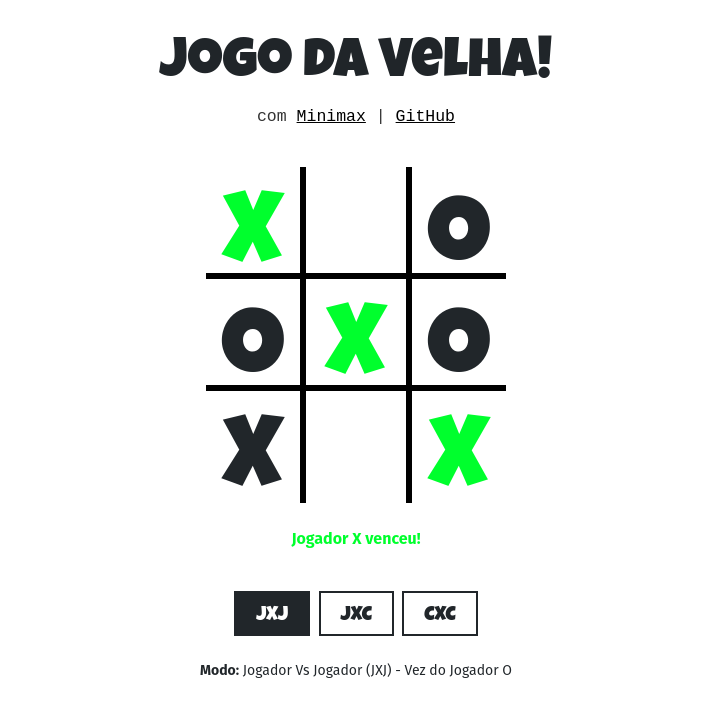

# Jogo da Velha
Projeto da disciplina de Inteligência Artificial do curso de Sistemas de Informação na UNI7, onde é desenvolvido um jogo da velha utilizando o algoritmo [Minimax](https://en.wikipedia.org/wiki/Minimax).

## Como jogar:
Basta clonar ou baixar o repositório e abrir o arquivo index.html no seu navegador.

## Modos de Jogo:
- Jogador X Jogador
- Jogador X Computador
- Computador X Computador

