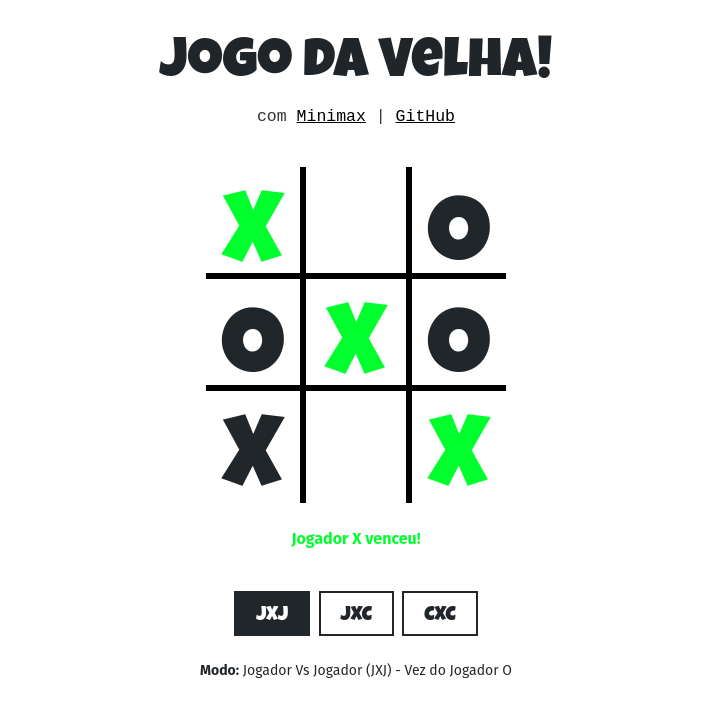

# 🎮 Jogo da Velha com Minimax

[](https://developer.mozilla.org/en-US/docs/Web/HTML)
[](https://developer.mozilla.org/en-US/docs/Web/CSS)
[](https://developer.mozilla.org/en-US/docs/Web/JavaScript)
[](https://getbootstrap.com/)

Projeto da disciplina de Inteligência Artificial do curso de Sistemas de Informação na UNI7, onde é desenvolvido um jogo da velha utilizando o algoritmo [Minimax](https://en.wikipedia.org/wiki/Minimax).

<!-- ## 🚀 Características

- ✨ **Interface moderna** com Bootstrap 5
- 🤖 **IA inteligente** usando algoritmo Minimax
- ♿ **Totalmente acessível** com suporte a leitores de tela
- ⌨️ **Navegação por teclado** funcional
- 📱 **Design responsivo** para todos os dispositivos
- 🎯 **Três modos de jogo** diferentes -->

## 🎯 Modos de Jogo

| Modo    | Descrição                                                        |
| ------- | ---------------------------------------------------------------- |
| **JXJ** | Jogador contra Jogador - Ideal para jogar com amigos             |
| **JXC** | Jogador contra Computador - Teste suas habilidades contra a IA   |
| **CXC** | Computador contra Computador - Veja a IA jogando contra si mesma |

## 🛠️ Tecnologias Utilizadas

- **HTML5** - Estrutura semântica e acessível
- **CSS3** - Estilos modernos e responsivos
- **JavaScript ES6+** - Lógica do jogo e algoritmo Minimax
- **Bootstrap 5** - Framework CSS para interface
- **Google Fonts** - Tipografia personalizada

## 🚀 Como Executar

<!-- ### Pré-requisitos

- Navegador web moderno (Chrome, Firefox, Safari, Edge)
- Servidor web local (opcional, mas recomendado) -->

### Instalação

1. **Clone o repositório**

   ```bash
   git clone https://github.com/hugojunior/uni7-jogo-da-velha.git
   cd uni7-jogo-da-velha
   ```

2. **Abra o jogo**

   Abra diretamente o arquivo `index.html` no navegador

## 🤖 Algoritmo Minimax

O algoritmo Minimax implementado neste projeto:

- **Analisa todas as possibilidades** de jogadas futuras
- **Escolhe a melhor jogada** para maximizar chances de vitória
- **Considera as jogadas do oponente** para minimizar suas chances
- **É impossível vencer** a IA em condições normais (só empate)

## 📁 Estrutura do Projeto

```
uni7-jogo-da-velha/
├── 📄 index.html          # Página principal
├── 📁 css/
│   └── 📄 app.css         # Estilização
├── 📁 scripts/
│   └── 📄 app.js          # Lógica do jogo e Minimax
├── 📁 images/             # Ícones e imagens
└── 📄 README.md           # Documentação (este arquivo)
```

---

<div align="center">
  
</div>
